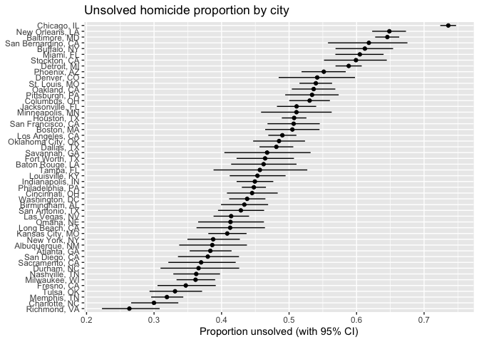

p8105_hw5_mk4996
================
Miho Kawanami
2025-11-13

# Problem 1

``` r
has_match_once = function(n) {
  bdays = sample(1:365, size = n, replace = TRUE)
  any(duplicated(bdays))
}

sim_p1 = tibble(group_size = 2:50) |>
  mutate(
    trials = map(group_size, \(g) replicate(10000, has_match_once(g))),
    prob   = map_dbl(trials, \(x) mean(x))
  )

sim_p1 |>
  ggplot(aes(x = group_size, y = prob)) +
  geom_line() +
  geom_point() +
  labs(x = "Group size", y = "P(at least one shared birthday)",
       title = "Birthday paradox simulation (10,000 trials each)")
```

<!-- -->

# Problem 2

## One trial

``` r
n     = 30
sigma = 5
alpha = 0.05
mu_grid = c(0,1,2,3,4,5,6)

one_trial = function(mu) {
  x = rnorm(n, mean = mu, sd = sigma)
  tt = t.test(x, mu = 0)
  tibble(
    mu_hat   = unname(tt$estimate),  
    p_value  = tt$p.value
  )
}
```

## Run 5000 simulations for each mu

``` r
sim_p2 = expand_grid(mu_true = mu_grid, iter = 1:5000) |>
  mutate(res = map(mu_true, one_trial)) |>
  unnest(res)
```

## Compute power and visualize

``` r
power_df = sim_p2 |>
  group_by(mu_true) |>
  summarize(power = mean(p_value < alpha), .groups = "drop")

power_df |>
  ggplot(aes(x = mu_true, y = power)) +
  geom_line() + geom_point() +
  labs(x = "True mean (mu)", y = "Power",
       title = "One-sample t-test power vs effect size")
```

<!-- -->

- **Comment** The plot shows how power increases as the true mean (µ)
  moves away from zero. When µ=0, power is approximately 0.05, matching
  the significance level (alpha=0.05). As the true mean increases, the
  probability of correctly rejecting the null hypothesis rises sharply,
  reaching nearly 1 for larger effect sizes. This pattern illustrates
  that stronger effects are easier to detect with a fixed sample size.

## Compare average mu_hat (overall vs significant)

``` r
avg_df = sim_p2 |>
  group_by(mu_true) |>
  summarize(
    avg_mu_hat_all   = mean(mu_hat),
    avg_mu_hat_reject = mean(mu_hat[p_value < alpha]),
    .groups = "drop"
  )

avg_df |>
  pivot_longer(-mu_true, names_to = "which", values_to = "avg_mu_hat") |>
  ggplot(aes(x = mu_true, y = avg_mu_hat, color = which)) +
  geom_line() + geom_point() +
  labs(x = "True mean (mu)", y = "Average of mu_hat",
       title = "Selection-induced bias when conditioning on rejection")
```

<!-- -->

- **Is the sample average of 𝜇̂ across tests for which the null is
  rejected approximately equal to the true value of 𝜇? Why or why not?**

No, the sample average of 𝜇̂ among rejected tests is not equal to the
true value of 𝜇. As shown in the second plot, the blue line (significant
results) is higher than the red line for small and moderate true means,
indicating an upward bias. This occurs because only extreme sample means
tend to be significant. As the true mean increases and power approaches
1, this bias becomes smaller.

# Problem 3

## Data Cleaning

``` r
homi = read_csv("./homicide-data.csv")
```

    ## Rows: 52179 Columns: 12
    ## ── Column specification ────────────────────────────────────────────────────────
    ## Delimiter: ","
    ## chr (9): uid, victim_last, victim_first, victim_race, victim_age, victim_sex...
    ## dbl (3): reported_date, lat, lon
    ## 
    ## ℹ Use `spec()` to retrieve the full column specification for this data.
    ## ℹ Specify the column types or set `show_col_types = FALSE` to quiet this message.

``` r
names(homi)
```

    ##  [1] "uid"           "reported_date" "victim_last"   "victim_first" 
    ##  [5] "victim_race"   "victim_age"    "victim_sex"    "city"         
    ##  [9] "state"         "lat"           "lon"           "disposition"

``` r
homi |> count(disposition, sort = TRUE)
```

    ## # A tibble: 3 × 2
    ##   disposition               n
    ##   <chr>                 <int>
    ## 1 Closed by arrest      25674
    ## 2 Open/No arrest        23583
    ## 3 Closed without arrest  2922

There’s no “NA” in disposition.

``` r
homi |>
  distinct(city, state) |>
  print(n = Inf)
```

    ## # A tibble: 51 × 2
    ##    city           state
    ##    <chr>          <chr>
    ##  1 Albuquerque    NM   
    ##  2 Atlanta        GA   
    ##  3 Baltimore      MD   
    ##  4 Baton Rouge    LA   
    ##  5 Birmingham     AL   
    ##  6 Boston         MA   
    ##  7 Buffalo        NY   
    ##  8 Charlotte      NC   
    ##  9 Chicago        IL   
    ## 10 Cincinnati     OH   
    ## 11 Columbus       OH   
    ## 12 Dallas         TX   
    ## 13 Denver         CO   
    ## 14 Detroit        MI   
    ## 15 Durham         NC   
    ## 16 Fort Worth     TX   
    ## 17 Fresno         CA   
    ## 18 Houston        TX   
    ## 19 Indianapolis   IN   
    ## 20 Jacksonville   FL   
    ## 21 Kansas City    MO   
    ## 22 Las Vegas      NV   
    ## 23 Long Beach     CA   
    ## 24 Los Angeles    CA   
    ## 25 Louisville     KY   
    ## 26 Memphis        TN   
    ## 27 Miami          FL   
    ## 28 Milwaukee      wI   
    ## 29 Minneapolis    MN   
    ## 30 Nashville      TN   
    ## 31 New Orleans    LA   
    ## 32 New York       NY   
    ## 33 Oakland        CA   
    ## 34 Oklahoma City  OK   
    ## 35 Omaha          NE   
    ## 36 Philadelphia   PA   
    ## 37 Phoenix        AZ   
    ## 38 Pittsburgh     PA   
    ## 39 Richmond       VA   
    ## 40 San Antonio    TX   
    ## 41 Sacramento     CA   
    ## 42 Savannah       GA   
    ## 43 San Bernardino CA   
    ## 44 San Diego      CA   
    ## 45 San Francisco  CA   
    ## 46 St. Louis      MO   
    ## 47 Stockton       CA   
    ## 48 Tampa          FL   
    ## 49 Tulsa          OK   
    ## 50 Tulsa          AL   
    ## 51 Washington     DC

There’re two errors in cities and states. Modify them below:

``` r
homi = homi |>
  mutate(state = toupper(state),
         city_state = str_c(city, ", ", state)) |>   
  filter(city_state != "Tulsa, AL")
```

## Raw Data

``` r
unsolved_levels = c("Closed without arrest", "Open/No arrest")
city_summary = homi %>%
  mutate(
    city_state = paste(city, state, sep = ", "),
    unsolved  = disposition %in% unsolved_levels
  ) |>
  group_by(city_state) |>
  summarise(
    n_total    = n(),
    n_unsolved = sum(unsolved),
    .groups = "drop"
  ) |>
  mutate(prop_unsolved = n_unsolved / n_total)

city_summary |>
  arrange(desc(n_total)) |>
  knitr::kable(digits = 3,
               col.names = c("City, State", "Total", "Unsolved", "Prop. Unsolved"))
```

| City, State        | Total | Unsolved | Prop. Unsolved |
|:-------------------|------:|---------:|---------------:|
| Chicago, IL        |  5535 |     4073 |          0.736 |
| Philadelphia, PA   |  3037 |     1360 |          0.448 |
| Houston, TX        |  2942 |     1493 |          0.507 |
| Baltimore, MD      |  2827 |     1825 |          0.646 |
| Detroit, MI        |  2519 |     1482 |          0.588 |
| Los Angeles, CA    |  2257 |     1106 |          0.490 |
| St. Louis, MO      |  1677 |      905 |          0.540 |
| Dallas, TX         |  1567 |      754 |          0.481 |
| Memphis, TN        |  1514 |      483 |          0.319 |
| New Orleans, LA    |  1434 |      930 |          0.649 |
| Las Vegas, NV      |  1381 |      572 |          0.414 |
| Washington, DC     |  1345 |      589 |          0.438 |
| Indianapolis, IN   |  1322 |      594 |          0.449 |
| Kansas City, MO    |  1190 |      486 |          0.408 |
| Jacksonville, FL   |  1168 |      597 |          0.511 |
| Milwaukee, WI      |  1115 |      403 |          0.361 |
| Columbus, OH       |  1084 |      575 |          0.530 |
| Atlanta, GA        |   973 |      373 |          0.383 |
| Oakland, CA        |   947 |      508 |          0.536 |
| Phoenix, AZ        |   914 |      504 |          0.551 |
| San Antonio, TX    |   833 |      357 |          0.429 |
| Birmingham, AL     |   800 |      347 |          0.434 |
| Nashville, TN      |   767 |      278 |          0.362 |
| Miami, FL          |   744 |      450 |          0.605 |
| Cincinnati, OH     |   694 |      309 |          0.445 |
| Charlotte, NC      |   687 |      206 |          0.300 |
| Oklahoma City, OK  |   672 |      326 |          0.485 |
| San Francisco, CA  |   663 |      336 |          0.507 |
| Pittsburgh, PA     |   631 |      337 |          0.534 |
| New York, NY       |   627 |      243 |          0.388 |
| Boston, MA         |   614 |      310 |          0.505 |
| Tulsa, OK          |   583 |      193 |          0.331 |
| Louisville, KY     |   576 |      261 |          0.453 |
| Fort Worth, TX     |   549 |      255 |          0.464 |
| Buffalo, NY        |   521 |      319 |          0.612 |
| Fresno, CA         |   487 |      169 |          0.347 |
| San Diego, CA      |   461 |      175 |          0.380 |
| Stockton, CA       |   444 |      266 |          0.599 |
| Richmond, VA       |   429 |      113 |          0.263 |
| Baton Rouge, LA    |   424 |      196 |          0.462 |
| Omaha, NE          |   409 |      169 |          0.413 |
| Albuquerque, NM    |   378 |      146 |          0.386 |
| Long Beach, CA     |   378 |      156 |          0.413 |
| Sacramento, CA     |   376 |      139 |          0.370 |
| Minneapolis, MN    |   366 |      187 |          0.511 |
| Denver, CO         |   312 |      169 |          0.542 |
| Durham, NC         |   276 |      101 |          0.366 |
| San Bernardino, CA |   275 |      170 |          0.618 |
| Savannah, GA       |   246 |      115 |          0.467 |
| Tampa, FL          |   208 |       95 |          0.457 |

- **Comment** The raw dataset includes *52178* homicide records across
  *50* large U.S. cities in *28* states/DC.  
  We created `city_state` (e.g., “Baltimore, MD”) and summarized within
  cities to obtain the total number of homicides (*`n_total`*) and the
  number of unsolved homicides (`n_unsolved`), where unsolved is defined
  as *“Closed without arrest”* or *“Open/No arrest”*.

## Baltimore

``` r
library(broom)

unsolved_levels = c("Closed without arrest", "Open/No arrest")

bal_counts = homi |>
  filter(city == "Baltimore", state == "MD") |>
  mutate(unsolved = disposition %in% unsolved_levels) |>
  summarise(
    n_total    = n(),
    n_unsolved = sum(unsolved, na.rm = TRUE),
    .groups = "drop"
  )

bal_pt = prop.test(bal_counts$n_unsolved, bal_counts$n_total)
bal_tidy = broom::tidy(bal_pt)
bal_tidy
```

    ## # A tibble: 1 × 8
    ##   estimate statistic  p.value parameter conf.low conf.high method    alternative
    ##      <dbl>     <dbl>    <dbl>     <int>    <dbl>     <dbl> <chr>     <chr>      
    ## 1    0.646      239. 6.46e-54         1    0.628     0.663 1-sample… two.sided

## All cities

``` r
homi = homi |>
  mutate(city_state = paste(city, state, sep = ", "))

unsolved_levels = c("Closed without arrest", "Open/No arrest")
city_summary = homi |>
  mutate(unsolved = disposition %in% unsolved_levels) |>
  group_by(city_state) |>
  summarize(
    n_total    = n(),
    n_unsolved = sum(unsolved, na.rm = TRUE),
    .groups = "drop"
  )

one_prop = function(x_success, x_total) {
  pt = prop.test(x_success, x_total)
  tibble(
    prop_hat = unname(pt$estimate),
    ci_low   = pt$conf.int[1],
    ci_high  = pt$conf.int[2]
  )
}

city_est = city_summary |>
  mutate(test = purrr::map2(n_unsolved, n_total, one_prop)) |>
  unnest(test)

city_est |>
  arrange(prop_hat) |>
  mutate(city_state = factor(city_state, levels = city_state)) |>
  ggplot(aes(x = city_state, y = prop_hat)) +
  geom_point() +
  geom_errorbar(aes(ymin = ci_low, ymax = ci_high), width = 0) +
  coord_flip() +
  labs(x = NULL, y = "Proportion unsolved (with 95% CI)",
       title = "Unsolved homicide proportion by city")
```

<!-- -->

- **Comment**

The plot shows the estimated proportions of unsolved homicides with 95%
confidence intervals for each city. There is substantial variation
across cities, for example, Baltimore, MD and Chicago, IL have some of
the highest proportions of unsolved cases, while Richmond, VA and Tulsa,
AL have the lowest. Cities with small numbers of total homicides, such
as Tulsa, show extremely wide confidence intervals that extend across
most of the range (0–1), reflecting the instability of estimates based
on small samples. Overall, the results highlight large disparities in
homicide case resolution rates across U.S. cities.
