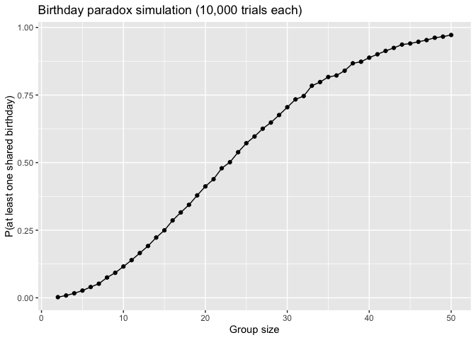
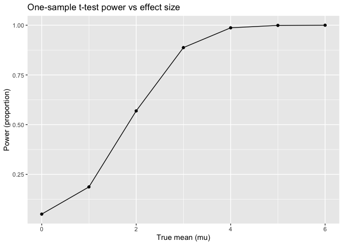
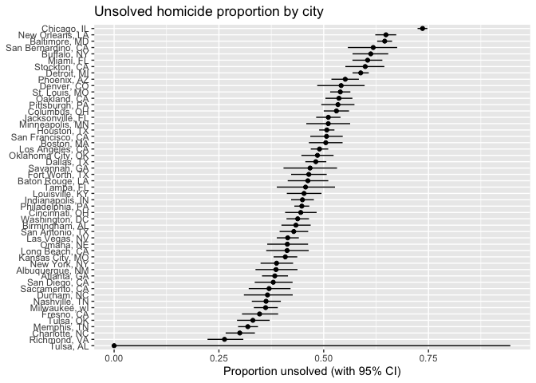

p8105_hw5_mk4996
================
Miho Kawanami
2025-11-13

# Problem 1

``` r
has_match_once = function(n) {
  bdays = sample(1:365, size = n, replace = TRUE)
  any(duplicated(bdays))
}

sim_p1 = tibble(group_size = 2:50) |>
  mutate(
    trials = map(group_size, \(g) replicate(10000, has_match_once(g))),
    prob   = map_dbl(trials, \(x) mean(x))
  )

sim_p1 |>
  ggplot(aes(x = group_size, y = prob)) +
  geom_line() +
  geom_point() +
  labs(x = "Group size", y = "P(at least one shared birthday)",
       title = "Birthday paradox simulation (10,000 trials each)")
```

<!-- -->

# Problem 2

## one trial

``` r
n     = 30
sigma = 5
alpha = 0.05
mu_grid = c(0,1,2,3,4,5,6)

one_trial = function(mu) {
  x = rnorm(n, mean = mu, sd = sigma)
  tt = t.test(x, mu = 0)
  tibble(
    mu_hat   = unname(tt$estimate),  
    p_value  = tt$p.value
  )
}
```

## Run 5000 simulations for each mu

``` r
sim_p2 = expand_grid(mu_true = mu_grid, iter = 1:5000) |>
  mutate(res = map(mu_true, one_trial)) |>
  unnest(res)
```

## Compute power and visualize

``` r
power_df = sim_p2 |>
  group_by(mu_true) |>
  summarize(power = mean(p_value < alpha), .groups = "drop")

power_df |>
  ggplot(aes(x = mu_true, y = power)) +
  geom_line() + geom_point() +
  labs(x = "True mean (mu)", y = "Power",
       title = "One-sample t-test power vs effect size")
```

<!-- -->

- **Comment** The plot shows how power increases as the true mean (µ)
  moves away from zero. When µ=0, power is approximately 0.05, matching
  the significance level (alpha=0.05). As the true mean increases, the
  probability of correctly rejecting the null hypothesis rises sharply,
  reaching nearly 1 for larger effect sizes. This pattern illustrates
  that stronger effects are easier to detect with a fixed sample size.

## Compare average mu_hat (overall vs significant)

``` r
avg_df = sim_p2 |>
  group_by(mu_true) |>
  summarize(
    avg_mu_hat_all   = mean(mu_hat),
    avg_mu_hat_reject = mean(mu_hat[p_value < alpha]),
    .groups = "drop"
  )

avg_df |>
  pivot_longer(-mu_true, names_to = "which", values_to = "avg_mu_hat") |>
  ggplot(aes(x = mu_true, y = avg_mu_hat, color = which)) +
  geom_line() + geom_point() +
  labs(x = "True mean (mu)", y = "Average of mu_hat",
       title = "Selection-induced bias when conditioning on rejection")
```

<!-- -->

- **Is the sample average of 𝜇̂ across tests for which the null is
  rejected approximately equal to the true value of 𝜇? Why or why not?**

No, the sample average of 𝜇̂ among rejected tests is not equal to the
true value of 𝜇. As shown in the second plot, the blue line (significant
results) is higher than the red line for small and moderate true means,
indicating an upward bias. This occurs because only extreme sample means
tend to be significant. As the true mean increases and power approaches
1, this bias becomes smaller.

# Problem 3

``` r
homi = read_csv("./homicide-data.csv")
```

    ## Rows: 52179 Columns: 12
    ## ── Column specification ────────────────────────────────────────────────────────
    ## Delimiter: ","
    ## chr (9): uid, victim_last, victim_first, victim_race, victim_age, victim_sex...
    ## dbl (3): reported_date, lat, lon
    ## 
    ## ℹ Use `spec()` to retrieve the full column specification for this data.
    ## ℹ Specify the column types or set `show_col_types = FALSE` to quiet this message.

``` r
homi = homi |>
  mutate(city_state = paste(city, state, sep = ", "))

unsolved_levels = c("Closed without arrest", "Open/No arrest")
city_summary = homi |>
  mutate(unsolved = disposition %in% unsolved_levels) |>
  group_by(city_state) |>
  summarize(
    n_total    = n(),
    n_unsolved = sum(unsolved, na.rm = TRUE),
    .groups = "drop"
  )

one_prop = function(x_success, x_total) {
  pt = prop.test(x_success, x_total)
  tibble(
    prop_hat = unname(pt$estimate),
    ci_low   = pt$conf.int[1],
    ci_high  = pt$conf.int[2]
  )
}

city_est = city_summary |>
  mutate(test = map2(n_unsolved, n_total, one_prop)) |>
  unnest(test)
```

    ## Warning: There was 1 warning in `mutate()`.
    ## ℹ In argument: `test = map2(n_unsolved, n_total, one_prop)`.
    ## Caused by warning in `prop.test()`:
    ## ! Chi-squared approximation may be incorrect

``` r
city_est |>
  arrange(prop_hat) |>
  mutate(city_state = factor(city_state, levels = city_state)) |>
  ggplot(aes(x = city_state, y = prop_hat)) +
  geom_point() +
  geom_errorbar(aes(ymin = ci_low, ymax = ci_high), width = 0) +
  coord_flip() +
  labs(x = NULL, y = "Proportion unsolved (with 95% CI)",
       title = "Unsolved homicide proportion by city")
```

<!-- -->

- **Comment**

The plot shows the estimated proportions of unsolved homicides with 95%
confidence intervals for each city. There is substantial variation
across cities, for example, Baltimore, MD and Chicago, IL have some of
the highest proportions of unsolved cases, while Richmond, VA and Tulsa,
AL have the lowest. Cities with small numbers of total homicides, such
as Tulsa, show extremely wide confidence intervals that extend across
most of the range (0–1), reflecting the instability of estimates based
on small samples. Overall, the results highlight large disparities in
homicide case resolution rates across U.S. cities.
